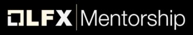

# Ryan Madhuwala (RAWx18)

### Lab Leader @ LF Decentralized Trust &nbsp;·&nbsp; Building open source infrastructure

  
  &nbsp;
  

  
  
  

## Backed By

**Supported by some of the most prestigious recognitions in open source.**

<table>
<tr>
<td align="center" width="260">
   
  <b>Lab Leader</b> 
  LF Decentralized Trust · at 20
</td>
<td align="center" width="260">
   
  <b>GitHub Secure Fund '26</b> 
  Top 50 projects worldwide
</td>
<td align="center" width="260">
   
  <b>Microsoft for Startups</b> 
  Founders Hub
</td>
</tr>
<tr>
<td align="center" width="260">
   
  <b>Vercel OSS Program</b> 
  Fall '26
</td>
<td align="center" width="260">
   
  <b>Mintlify OSS Program</b> 
  2026
</td>
<td align="center" width="260">
   
  <b>LFX Mentorship Mentee</b> 
  '25 · Hyperledger Foundation
</td>
</tr>
<tr>
<td align="center" width="260">
   
  <b>LFX Mentorship Mentor</b> 
  '26 · LF Decentralized Trust
</td>
<td align="center" width="260">
   
  <b>Founders Inc</b> 
  Canopy Program · Online
</td>
<td align="center" width="260">
   
  <b>OSS Summits</b> 
  KR · JP · EU · IN · CN · NA
</td>
</tr>
</table>

## Things I Built

<table>
<tr>
<td width="50%" valign="top">

### [Caracal](https://github.com/Garudex-Labs/caracal)

Backed by **GitHub** · **Microsoft** · **Vercel**

</td>
<td width="50%" valign="top">

### [GitMesh](https://github.com/LF-Decentralized-Trust-labs/gitmesh)

Now under the **Linux Foundation** · Backed by **Mintlify**

</td>
</tr>
</table>

## The Numbers

## Python Eating My Python3 Contributions 🐍

Built in public. Always shipping.

